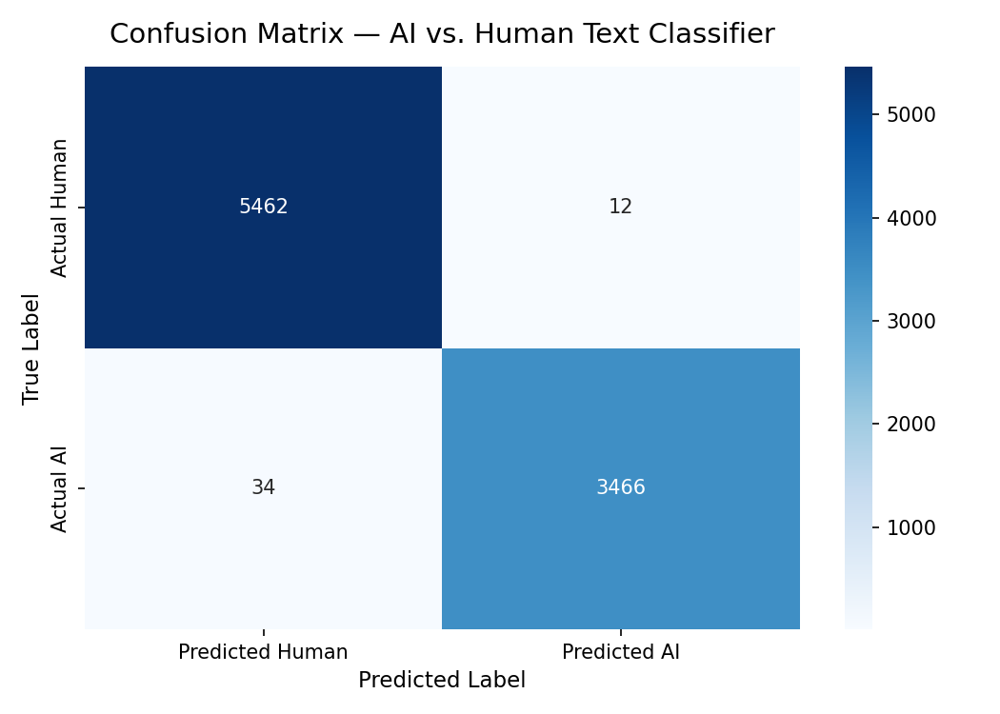
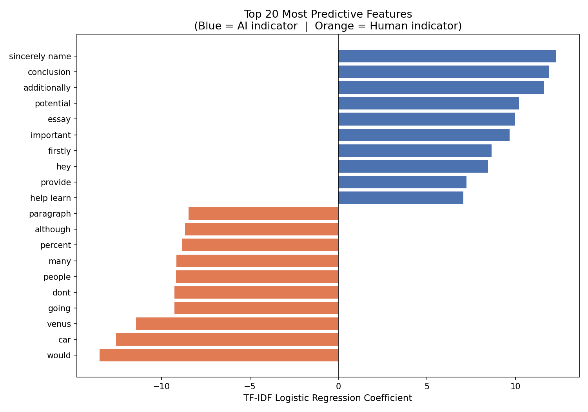

# AI vs. Human Text Classifier

A binary text classification model that distinguishes between
**student-written essays** and **AI-generated text** using
TF-IDF feature extraction and Logistic Regression.

---

## Project Overview

| Item | Detail |
|------|--------|
| Task | Binary classification (Human = 0, AI = 1) |
| Dataset | DAIGT V2 Train Dataset |
| Algorithm | Logistic Regression + TF-IDF (1-gram & 2-gram) |
| Target Accuracy | 86 – 90% |
| Environment | Google Colab (Python 3.x) |

---

## Repository Structure

```
AI-vs-Human-Text-Classifier/
│
├── classifier_notebook.ipynb   # Main Colab notebook (full pipeline)
├── confusion_matrix.png        # Evaluation heatmap
├── top_features.png            # Top 20 predictive features chart
├── tfidf_vectorizer.pkl        # Serialised TF-IDF vectorizer
├── logistic_model.pkl          # Serialised trained model
└── README.md
```

---

## Methodology

### 1. Text Preprocessing
Raw essays are passed through a sequential cleaning pipeline:
- **Lowercasing** — normalises vocabulary
- **HTML tag removal** — strips any markup from web-scraped data
- **Non-alphabetic character removal** — eliminates punctuation and numbers
- **Stopword removal** — drops common words (e.g., "the", "is") that carry no discriminative signal (NLTK English stopword list)
- **Lemmatization** — reduces inflected forms to their base form (e.g., "writing" → "write") using NLTK's `WordNetLemmatizer`

### 2. Feature Engineering — TF-IDF

**TF-IDF (Term Frequency–Inverse Document Frequency)** converts text into a numerical matrix where each value reflects how important a word (or phrase) is to a specific document relative to the entire corpus.

- **TF (Term Frequency):** how often a term appears in a document
- **IDF (Inverse Document Frequency):** penalises terms that appear in many documents (common = less informative)
- **`sublinear_tf=True`:** applies `log(1 + tf)` to dampen the impact of very frequent terms
- **`ngram_range=(1, 2)`:** includes both single words (unigrams) and consecutive word pairs (bigrams), which captures structural patterns characteristic of AI text (e.g., "it is important", "in conclusion")
- **`max_features=10000`:** retains the 10,000 most informative n-gram features

### 3. Model — Logistic Regression

Logistic Regression learns a weighted linear boundary between the two classes in the high-dimensional TF-IDF space.

- **`class_weight='balanced'`:** automatically adjusts weights to compensate for any class imbalance, preventing the model from biasing toward the majority class
- **`solver='saga'`:** efficient stochastic gradient descent solver suited for large, sparse matrices
- **Regularisation parameter `C`:** controls the bias–variance trade-off; tuned via `RandomizedSearchCV` with 5-fold cross-validation across 8 candidate values (0.01 → 50)

---

## Results

| Metric | Human (0) | AI (1) | Weighted Avg |
|--------|-----------|--------|--------------|
| **Accuracy** | — | — | **XX.XX%** |
| **Precision** | X.XX | X.XX | X.XX |
| **Recall** | X.XX | X.XX | X.XX |
| **F1-Score** | X.XX | X.XX | X.XX |

> Replace the `XX` placeholders with actual values from `Cell 8` after running the notebook.

### Confusion Matrix


### Top 20 Most Predictive Features


---

## How to Run

1. Open `classifier_notebook.ipynb` in [Google Colab](https://colab.research.google.com)
2. Download `train_v2_drcat_02.csv` from the dataset link below
3. Run all cells in order (`Runtime → Run all`)
4. Artifacts (`*.pkl`, `*.png`) are saved to `/content/` automatically

---

## Dependencies

```
pandas
numpy
scikit-learn
matplotlib
seaborn
nltk
```

Install in one command:
```bash
pip install pandas numpy scikit-learn matplotlib seaborn nltk
```

---

## Dataset Attribution

**DAIGT V2 Train Dataset**
- **Source:** Kaggle — [https://www.kaggle.com/datasets/thedrcat/daigt-v2-train-dataset](https://www.kaggle.com/datasets/thedrcat/daigt-v2-train-dataset)
- **File used:** `train_v2_drcat_02.csv`
- **Labels:** `0` = Human-written student essay | `1` = AI-generated text
- **Hosted by:** thedrcat on Kaggle
- **Use case:** Academic integrity research / AI-detection classifier training

---

## License

This project is released for educational and academic use only.
